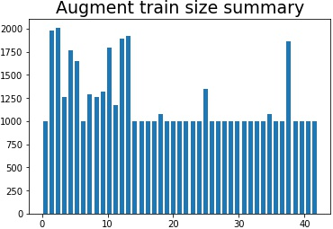
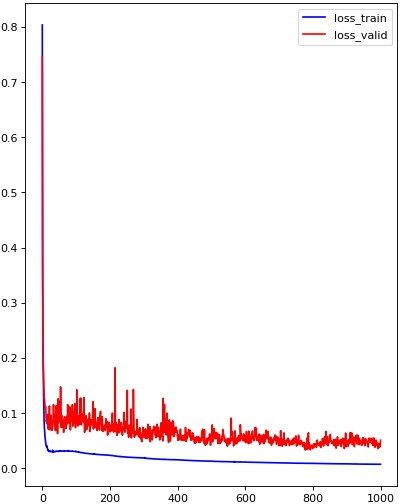
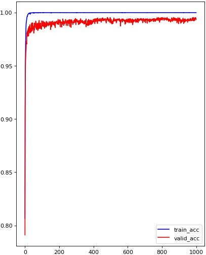

# **Traffic Sign Recognition** 

## Writeup

---

**Build a Traffic Sign Recognition Project**

The goals / steps of this project are the following:
* Load the data set (see below for links to the project data set)
* Explore, summarize and visualize the data set
* Design, train and test a model architecture
* Use the model to make predictions on new images
* Analyze the softmax probabilities of the new images
* Summarize the results with a written report

## Rubric Points
### Here I will consider the [rubric points](https://review.udacity.com/#!/rubrics/481/view) individually and describe how I addressed each point in my implementation.  

---
### Writeup / README

### Data Set Summary & Exploration

#### 1. Provide a basic summary of the data set. In the code, the analysis should be done using python, numpy and/or pandas methods rather than hardcoding results manually.

I used the numpy library to calculate summary statistics of the traffic
signs data set:  
  
Number of training examples = 34799  
Number of validation examples = 4410  
Number of testing examples = 12630  
Image data shape = (32, 32, 3)  
Number of classes = 43  

#### 2. Include an exploratory visualization of the dataset.  

Here is an exploratory visualization of the data set.   

  

All classes is shown below.  
  

### Design and Test a Model Architecture

#### 1. Describe how you preprocessed the image data. What techniques were chosen and why did you choose these techniques? Consider including images showing the output of each preprocessing technique. Pre-processing refers to techniques such as converting to grayscale, normalization, etc. (OPTIONAL: As described in the "Stand Out Suggestions" part of the rubric, if you generated additional data for training, describe why you decided to generate additional data, how you generated the data, and provide example images of the additional data. Then describe the characteristics of the augmented training set like number of images in the set, number of images for each class, etc.)  

In preprocessing step, I use cv2.equalizeHist(cv2.cvtColor(image, cv2.COLOR_RGB2GRAY) and normalization. Select 5 original images randomly and show below.  
  
cv2.cvtColor(image, cv2.COLOR_RGB2GRAY) is for grayscaling, which is suitable for my modle input. And grayscaling would help to minimize the effect of differing saturation of colors, such as dark night and varying light conditions.  
  
equalizeHist can improve the contrast in an image, in order to stretch out the intensity range. And the texture of image will be more clear than before, it can be seen from below images after equalizeHist.  
 

All data should minus X_train mean valve and divided by X_train stdvar for normalization, because it can rescale data to -1~1, which will be suitable for W's scope and make network easily trained.  
As for augmented data, I use rotation, translation, warpAffine, scaling and brightness adjusted and add up to at least 1000 images for each class.  
  

#### 2. Describe what your final model architecture looks like including model type, layers, layer sizes, connectivity, etc.) Consider including a diagram and/or table describing the final model.  

My final model consisted of the following layers:  

| Layer         	|     Description	        		| 
|:---------------------:|:---------------------------------------------:| 
| Input         	| 32x32x1 gray image   				| 
| Convolution 1x1     	| 1x1 stride, valid padding, outputs 32x32x16 	|
| RELU			|						|
| Convolution 5x5	| 1x1 stride, valid padding, outputs 28x28x32   |
| RELU			|						|
| Max pooling	      	| 2x2 stride,  outputs 14x14x32 		|
| Convolution 1x1     	| 1x1 stride, valid padding, outputs 14x14x32 	|
| RELU			|						|
| Convolution 5x5	| 1x1 stride, valid padding, outputs 10x10x64   |
| RELU			|						|
| Max pooling	      	| 2x2 stride,  outputs 5x5x64 		        |
| Convolution 1x1     	| 1x1 stride, valid padding, outputs 5x5x64 	|
| RELU			|						|
| Flatten	| conv4+conv5, outputs 3200       		|
| Dropout		| keep_prob 0.5					|
| Fully connected	| conv4+conv5, outputs 128       		|
| RELU   		|         					|
| Dropout		| keep_prob 0.5					|
| Logits        	| outputs 43     				|

 

#### 3. Describe how you trained your model. The discussion can include the type of optimizer, the batch size, number of epochs and any hyperparameters such as learning rate.  
  
EPOCHS = 1000  
BATCH_SIZE = 128  
Laarning_rate = 0.0009  
AdamOptimizer  

#### 4. Describe the approach taken for finding a solution and getting the validation set accuracy to be at least 0.93. Include in the discussion the results on the training, validation and test sets and where in the code these were calculated. Your approach may have been an iterative process, in which case, outline the steps you took to get to the final solution and why you chose those steps. Perhaps your solution involved an already well known implementation or architecture. In this case, discuss why you think the architecture is suitable for the current problem.  
  
My final model results were:  
EPOCH 1000  
Valid Acc: 0.993  
Train Acc: 1.000  
Loss: 0.0074108435  
Test Accuracy = 0.973  
  
  
  

If an iterative approach was chosen:
* What was the first architecture that was tried and why was it chosen?  
I choose Lenet, because it is excellent for mnist dataset.  
  
* What were some problems with the initial architecture?  
With lenet I only get about 0.7 on test dataset, but above 0.9 on train data. I think Lenet is easily overfitting without dropout and L2 norm.  
  
* How was the architecture adjusted and why was it adjusted? Typical adjustments could include choosing a different model architecture, adding or taking away layers (pooling, dropout, convolution, etc), using an activation function or changing the activation function. One common justification for adjusting an architecture would be due to overfitting or underfitting. A high accuracy on the training set but low accuracy on the validation set indicates over fitting; a low accuracy on both sets indicates under fitting.  
Add more Convolution layer，especially 1 by 1 layer, and reduce full connection layer size to 1 and reduce it's number of neuron. Use max pooling and dropout to avoid overfitting.   
  
* Which parameters were tuned? How were they adjusted and why?  
Epoch, batchsize and learningrate are usually tuned. Increase epoch when loss curve is not in valley and still. Increase learningrate if loss curve decrease too slow. In my experiment，batchsize seems not make a big difference. So it's the last parameter I will try to tune.  

* What are some of the important design choices and why were they chosen? For example, why might a convolution layer work well with this problem? How might a dropout layer help with creating a successful model?  
In the first fc layer, I input conv4 and conv5 to it. It seems multiscale layer feature can increase the performance.  
  
If a well known architecture was chosen:  
I will try Alex net transfer learning for feature extraction later.  
* What architecture was chosen?  
* Why did you believe it would be relevant to the traffic sign application?  
* How does the final model's accuracy on the training, validation and test set provide evidence that the model is working well?  
   

### Test a Model on New Images
  
I screenshot 35 traffic sign images from a video on youtube. It it dark and rainning when driving. And the size of image is different from each other because I screenshot really randomly about the size. And some images may not belong to the 43 classes, such as 1st, 6th, 15th, 16th and so on. For 4 and 10, they have rain drop on the image. For 5, 11, 25 and 16, they are a little dark. For 17, 20 and 33, they are shifted and rotated. They may all difficult for the model to classify.  
  
Output top 5 softmax probabilities class images for compare.  
  

In the 35 new images, 25 images are classified properly, 10 are not belong to dataset classes. So the accuracy on new images is about 100%. It's pretty good. So I think my model works just fine on new images.  

### (Optional) Visualizing the Neural Network (See Step 4 of the Ipython notebook for more details)
#### 1. Discuss the visual output of your trained network's feature maps. What characteristics did the neural network use to make classifications?  
I displayed first 3 layer's feature maps. It seems first 1 by 1 layer is about color channel, the second 5 by 5 layer is about texture channel, the third layer seems really abstract.  

